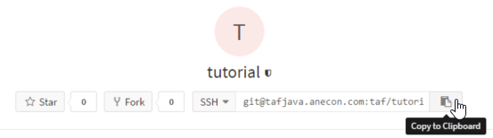

Einleitung
==========

Dieses Tutorial wurde im Rahmen eines eintägigen Intensivtrainings entwickelt, um Anecondas den Umgang mit unserem Testautomatisierungsframework näher zu bringen.

Nach der Vorbereitung startest du mit einem Beispielprojekt, das bereits Keywordstrukturen und Testfälle enthält - in diesen sind aber noch einige Aufgaben zu erledigen, die im Code zB. mit "TODO #1" markiert sind. Du kannst entweder direkt nach ihnen suchen, oder die entsprechenden Stellen in den jeweiligen Übungsunterseiten ("TODO #1: ...") hier in der Dokumentation nachschlagen.

Vorkenntnisse
-------------

Du musst keine professionelle Erfahrung mit Java haben, damit du aus diesen Übungen das eine oder andere lernen kannst. Solange du bestehenden Code lesen kannst, weiß wie man Objekte und Methoden erstellt und aufruft und wie man sich ungefähr zurecht findet, solltest du genug Wissen für die ersten Schritte!
Solltest du auf Grund deiner Programmierkenntnisse Bedenken haben: probier einfach mal wie weit du kommst, und schmöker nebenbei vielleicht in Büchern zu Java - ein gutes, kostenloses eBook namens `Java ist auch eine Insel`_ findest du etwa beim Rheinwerk Verlag.

.. _Java ist auch eine Insel: http://openbook.rheinwerk-verlag.de/javainsel/

Übung
-----

Die Übungen haben zum Ziel, dass du viel selbst ausprobierst und versuchst - fertige Lösungen werden hier nur sehr spärlich angegeben.
Allerdings findest du im Übungsprojekt schon einigen Code, an dem du dich orientieren kannst, wenn du die Übungen abarbeitest. Themen, die weitere Erklärung benötigen, werden in den jeweiligen Unterseiten näher beschrieben.

Solltest du mit den Informationen, sowohl hier im Tutorial, als auch mit dem bestehenden Code, nicht in der Lage sein die Übungen zu vervollständigen, kannst du jederzeit einen Übungsverantwortlichen für weitere Hilfe anfragen. Einerseits kann dir selbst damit geholfen werden, andererseits kann dann auch dieses Tutorial so angepasst werden, dass auch andere die notwendigen Informationen bekommen können.

Du wirst in diesem Tutorial zwei Rollen kennen lernen, die oft auf unterschiedliche Menschen mit unterschiedlichem Kenntnisstand aufgeteilt sind - einerseits das "reine Testautomatisieren", wo du vorhandene Keywords und Data Provider verwendest um neue Tests zu schreiben, andererseits die Rolle, in der du neue Keywords erstellst.
Dies kann, vor allem wenn du dich mit Java noch nicht so gut auskennst, durchaus eine Herausforderung werden!

Die Übungen bauen auch aufeinander auf, und sollen dich auch schrittweise dazu bringen, immer mehr selber auszuprobieren, oder selbst abzuleiten. Dementsprechend weniger wird auch die Beschreibung der einzelnen Tasks. Solltest du dennoch das Gefühl haben, dass es viel zu wenig ist - meld dich :)

Mit dieser Übung vertraut ist momentan Markus Möslinger.

Vorbereitung
------------

Zur Vorbereitung benötigst du erstmal Git, Java 1.8 und IntelliJ - Infos zum Download und zur Konfiguration findest du unter :doc:`/user/firststeps` in der Userdokumentation - dort steht auch beschrieben wie du Git so einrichtest, damit du die Projekte auschecken kannst.

.. note::

    Du musst erstmal nur die Seite :doc:`/user/firststeps` beachten! Bist du mit dieser Seite fertig kannst du zurück zum Tutorial und hier weitermachen. Ein Klick auf "*Next*" bei den ersten Schritten würde dich zur Seite "*Projektbeginn*" bringen, welche für diese Übung nicht relevant ist.

Außerdem brauchst du auch Chrome installiert :)
Prinzipiell funktioniert Selenium mit unterschiedlichen Browsern, für dieses Tutorial wird jedoch Chrome empfohlen.

Sobald du das alles eingerichtet hast, kannst du schon das Tutorialpackage downloaden - zu allererst benötigst du das Übungsprojekt, welches du `auf GitLab`_ findest - die Zugangsdaten sind hierfür die selben wie für deinen Windows-Login.

Vom GitLab-Projekt kopierst du den Verbindungsstring, wie am folgenden Bild ersichtlich.

Anschließend kannst du IntelliJ starten - unter Umständen wird dir trotz kostenloser Community Edition eine 30tägige Testversion der Ultimate-Edition angeboten - dies kannst du ruhig annehmen, nach einem Monat wird automatisch auf die Community Edition umgestellt.
Beim Anschließenden Einrichten von IntelliJ kannst du dir ein Farbschema aussuchen (Dunkel oder Hell) - die restlichen Einstellungen können weitergeklickt werden.

Sobald du mit der Einrichtung fertig bist, hast du die Option, ein Projekt aus der Versionskontrolle auszuchecken - diese Option wählst du, fügst den von GitLab kopierten Connectionstring rein, und suchst dir einen Ordner für dein Projekt aus - als Überordner empfiehlt sich etwa ``C:\dev``, der Name selbst wird automatisch ausgefüllt (*tutorial*) und kann belassen werden.

Sollte ein Dialogfenster von wegen "Import Project from existing sources" aufpoppen, kannst du die "Import"-Radiobox auswählen, dann Maven in der Liste wählen, und die folgenden Einstellungen bis zur Konfiguration des JDKs überspringen.
Klicke auf das Hinzufügen-Icon, und suche die von dir installierte Java-Version heraus - nachdem du etwa den Ordner ``C:\Program Files\Java\jdk1.8.0_91`` ausgewählt hast, kannst du das SDK hinzufügen und weitermachen :)

Es werden auch regelmäßig Meldungen wegen der Windows Firewall aufpoppen - diese kannst du bestätigen.

Zusätzlich brauchst du dann noch die Applikation, die wir zum Testen verwenden: espoCRM. Dies kannst du `als ZIP von GitLab`_ runterladen. Nachdem du espoCRM entpackt hast, kannst du die ``UwAmpUAC.exe`` starten, um einen lokalen Web Server zu starten - unter http://localhost/espocrm/ kannst du dann die Applikation öffnen.

.. note::

    Sollte die Seite auf http://localhost/espocrm/ nicht oder nur langsam reagieren, vergewissere dich, dass du ``UwAmpUAC.exe`` noch geöffnet hast, und stoppe & starte vielleicht den Webserver erneut, mit Hilfe der Buttons in der linken, oberen Ecke.

.. _auf GitLab: https://code.anecon.com/taf/tutorial
.. _als ZIP von GitLab: https://code.anecon.com/examples/espoCRM/repository/archive.zip?ref=master

.. note::

    Oft blockiert Skype den HTTP-Port **80**, welcher jedoch vom espoCRM benötigt wird. Solltest du den Server über *UwAmpUAC* nicht starten können, dann schließe entweder Skype, oder deaktiviere den Port 80 für Skype, indem du "Ports 80 und 443 für zusätzliche eingehende Verbindungen verwenden" unter *Aktionen -> Optionen -> Erweitert -> Verbindung* deaktivierst.

Der Adminaccount hat den Usernamen ``admin`` und das Passwort ``swqd2016``.

Wenn alles funktioniert kannst du dich erst mit espoCRM vertraut machen, und dann auch schon bei :doc:`/tutorial/task1` weiterlesen!