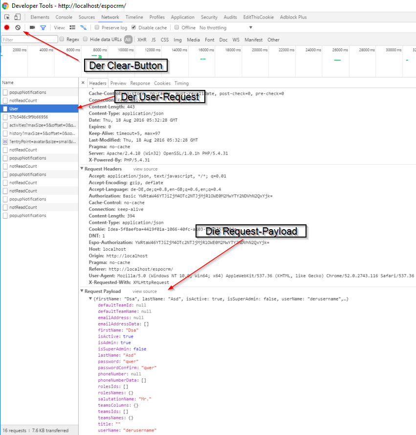

TODO #3: DataProvider & REST-Keywords
=====================================

DataProvider
------------

Wie vielleicht schon aufgefallen ist, befindet sich in der ``LoginTestCase``-Klasse ein weiterer Testfall, der deaktiviert ist (erkennbar an ``(enabled = false)`` neben der ``@Test``-Annotierung).
Der Testfall lässt sich einfach aktivieren indem die Annotierung lediglich auf ``@Test`` geändert wird - sobald das erledigt ist erscheint auch ein grüner Pfeil neben der Methode, um den Test zu starten.

Wegen eines anderen Fehlers, der in :doc:`/tutorial/task7` behandelt wird, schlägt der Testfall noch fehl - was uns nicht daran hindert, ihn trotzdem näher anzusehen.

Im Prinzip macht ``testLoginProvider()`` das selbe wie ``testLoginExplicitCredentials`` - Login mit einem User, auslesen des Usernamen, Überprüfung desselben.
Der Unterschied liegt in den ersten zwei Zeilen:

Während ``testLoginExplicitCredentials()`` den Usernamen explizit angibt, wird in ``testLoginProvider()`` ein Data Provider mittels ``data().espo().user().createUser()`` aufgerufen, welcher ein User-Objekt zurückliefert. Der Data Provider legt den User (mit welchen Details auch immer, diese sind in dem Fall, für diesen Test, irrelevant) in espoCRM an (wie auch immer, Hauptsache er existiert für den Test) und stellt ihn für den weiteren Verlauf zur Verfügung.

Sobald der Testfall aus ist, wird der User auch automatisch wieder gelöscht - der Testfall richtet sich also selbst die notwendigen Daten her, und räumt auch hinter sich wieder auf, ohne dass der Testfall das irgendwo implementieren muss!

Um zu sehen wie das funktioniert kannst du dir die Definition von ``createUser()`` ansehen: in der ersten Zeile werden User-Keywords (nämlich ``UserRestEspoKeywords``) zur Anlage verwendet, mit Default-Daten und einem Usernamen mit zufälliger Zahl hintendran, damit es möglichst zu keinen Kollisionen kommt.
Mit der zweiten Zeile, ``undoStack.undoWith(...)``, merkt sich das Keywordobjekt, welche Aktionen durchgeführt werden müssen, damit die Umgebung danach wieder "bereinigt" ist.
Anschließend wird der erstellte User als return-Wert an den Aufrufer, in unserem Falle zum Test, zurückgegeben.

REST-Keywords
-------------

Die eigentliche Interaktion mit espoCRM befindet sich also in den REST-Keywords, in der Methode ``userKeywords.createUser(...)``.
Dort wird zuerst mal das User-Objekt erzeugt, welches an espoCRM gesendet werden soll - alle Daten werden als Parameter übergeben.

Die eigentliche Interaktion geschied ab ``restApi``: ``.path("User")`` gibt an, dass die User-Resource bearbeitet werden soll, ``.request(MediaType.APPLICATION_JSON)`` definiert, dass der Request den *Content-Type* *JSON* haben soll, und ``.post(Entity.entity(user, MediaType.APPLICATION_JSON_TYPE), User.class)`` sendet dann den POST-Request an die REST-API ab: ``Entity.entity(...)`` wandelt den ersten Parameter gemäß dem zweiten Parameter um, um ihn als Payload mit dem Request mitzuschicken; in diesem Fall wird also der definierte User zu JSON *serialisiert*. Der letzte Parameter, ``User.class``, gibt an, welcher Typ in der Response von espoCRM erwartet wird: espoCRM schickt den erzeugten User wieder zurück, mit ``User.class`` kann dieser automatisch wieder in ein Java-Objekt verwandelt werden (man spricht von *deserialisieren*).

Der von espoCRM zurückgeschickte User enthält nützliche Informationen wie die interne ID des Datenbankeintrags, allerdings kein Passwort - dieses muss erneut gesetzt werden bevor das Objekt dem zurückgegeben wird, damit das Passwort im Testfall auch ausgelesen werden kann.

Der eigentliche Inhalt von *TODO #3* ist den DataProvider so zu erweitern, dass spezifiziert werden kann, ob der angelegte User Admin sein soll oder nicht. Hierfür müssen folgende Punkte erledigt werden:

- Erstellen einer zusätzlichen ``createAdmin()``-Methode im ``UserDataProvider``
- Hinzufügen von ``boolean isAdmin`` zur ``createUser``-Methode in ``UserRestEspoKeywords`` (und Übergabe von ``false`` in der bestehenden ``createUser()``-Methode im Data Provider)
- Erweiterung der ``User``-Klasse, um ``isAdmin`` speichern zu können

Die ersten beiden Punkte sollten sich mit dem vorhandenen Code relativ leicht erledigen lassen - deshalb wird hier nur die Erweiterung der ``User``-Klasse beschrieben.

User & (De)Serialisierung
-------------------------

Wie vorher erwähnt, wird das Java-Objekt ``user`` automatisch in JSON verwandelt - dies geschieht nach einem festen Muster: zum Serialisieren, also zur Verwandlung **nach** *JSON* wird jede ``getXyz()``-Methode betrachtet, wobei der Rückgabewert des Getters in das Attribut *xyz* geschrieben wird - zuerst muss also herausgefunden werden wie denn das entsprechende Admin-Attribut, das espoCRM erwartet, heißt.

Hier helfen wieder die Developer-Tools von Chrome weiter: öffne den *Network*-Tab, gehe zur `Useranlageseite`_ (rechts oben im Menü auf Administration, dann Users, dann "Create User") und füll das Formular mit den notwendigen Daten aus. Bevor du auf Absenden klickst kannst du alle Requests mit dem "Clear"-Button im Network-Tab löschen, um eine bessere Übersicht zu bekommen.

Sobald du auf "*Save*" drückst, sollte ein Request namens "*User*" erscheinen - diesen kannst du öffnen, und im "*Headers*"-Reiter, ganz unten, die vom Browser mitgeschickte Payload betrachten.

Hier kannst du nun sehen, dass das Attribut "*isAdmin*" heißt - der Getter muss also ``getIsAdmin()`` heißen. Analog dazu benötigst du auch einen Setter ``setIsAdmin(boolean isAdmin)``. Die Implementierung der Setter und Getter kannst du dir bei den übrigen Methoden im ``User``-Objekt absehen.

.. note::

    Gemäß Java-Namensrichtlinien für Getter & Setter von boolschen Werten sollten die Methoden eigentlich ``isAdmin()`` und ``setAdmin(boolean isAdmin)`` lauten - würdest du das allerdings so übernehmen, stünde im serialisierten JSON das Attribut ``admin``, womit espoCRM nichts anfangen kann - denn es soll ja schließlich ``isAdmin`` heißen.

Mit diesem Wissen, und vorhandenem Code zur Orientierung, solltest du in der Lage sein die Übung abzuschließen!

.. _Useranlageseite: http://localhost/espocrm/#User/create