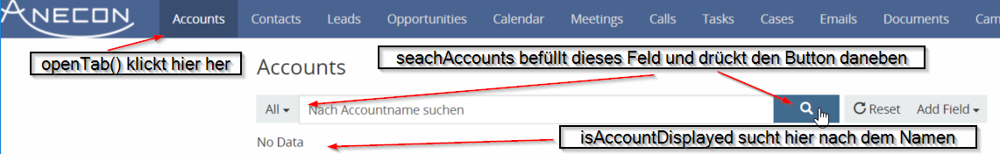

TODO #4: Suche nach Accounts implementieren
===========================================

TODO #4 wiederholt großteils bereits bekannte Inhalte: Selektoren rausfinden & UI-Keywords schreiben.
Neu dazu kommt das Einhängen einer noch nicht verwendeten Keyword-Klasse: ``AccountsUiKeywords``.

Ziel der Übung ist, dass aus einem Testfall heraus zum Accounts-Tab hinnavigiert werden kann, um dort nach Accounts zu suchen und zu überprüfen, ob ein bestimmter Account in der Ergebnisliste angezeigt wird.

Erweitern der AccountsUiKeywords
--------------------------------

Die ``openTab()``-Methode, um den Link oben in der Navigation zu klicken, existiert bereits, greift aber noch auf einen leeren CSS-Selektor (``ACCOUNT_TAB``) zu - für diesen musst du erst mal einen passenden Selektor finden.

``searchAccounts(String queryText)`` soll den Text, der übergeben wird, in das Accountsuchfeld eingeben können, und anschließend auf den Such-Button drücken. Du benötigst in der Methode also zwei Aufrufe zu ``selenium....`` - allerdings fehlt für die beiden Elemente, Textfeld & Button, auch noch die komplette Selektor-Definition!

``isAccountDisplayed(String name)`` bekommt einen Account-Namen übergeben, und soll überprüfen, ob dieser Name dann auch angezeigt wird - die einfachste Variante wäre nach dem Text **irgendwo** auf der Seite zu suchen, vielleicht findest du aber auch noch eine genauere Lösung :)

Einhängen in Keyword-Struktur
-----------------------------

Wenn du diese drei Punkte abgearbeitet hast, könntest du theoretisch schon einen Testfall dazu schreiben - allerdings kannst du von Tests die neuen Keywords nicht erreichen, da es kein ``apps().espo().ui().accounts()`` gibt!

Dafür musst du die Klasse ``UiEspoKeywords`` so anpassen, dass die ``AccountsUiKeywords`` beim Aufruf einer neuen ``accounts()``-Methode zurückgegeben werden - als Orientierung kannst du die bestehende ``profileMenu()``-Methode verwenden.

Test schreiben
--------------

Anschließend kannst du einen Testfall schreiben der nach einem bestehenden Account sucht und überprüft, ob dieser auch angezeigt wird.
Idealerweise erstellst du hierfür neben dem ``LoginTestCase`` eine weitere Testklasse, da dieser Test mit Logins nicht mehr viel zu tun hat!